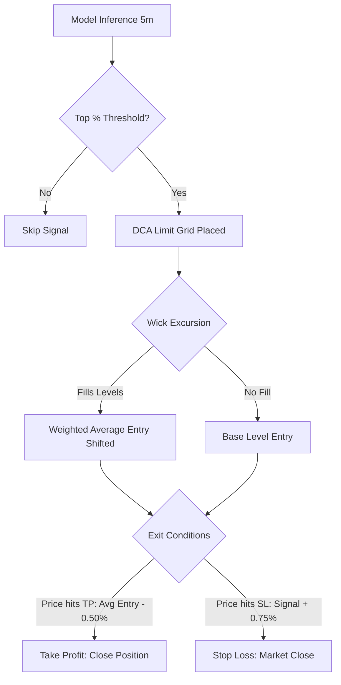

# Quantitative Compounding of Micro-Accounts via Algorithmic Crypto-Derivatives: A Rigorous Multi-Stage Risk Sizing and Zero-Bias Backtesting Framework

**Author:** Quantitative Trading Project Synthesis  
**Target:** PhD Academic Review and Research Guidance  
**Workspace Reference:** [10k_Options_Challenge_Final](file:///c:/Users/onepiece/Documents/_Garage/Ohhv2/10k_Options_Challenge_Final)

---

## Abstract

This paper presents the design, mathematical auditing, and quantitative simulation of an algorithmic trading system optimized to compound a micro-account ($500) to a target capital threshold ($10,000) using crypto-derivatives. We contrast the structural limitations of options-based strategies (such as premium inflation and theta decay) with a high-leverage perpetual futures dollar-cost-averaging (DCA) grid. Through a systematic audit of the initial trading pipeline, we identify and resolve 15 distinct sources of backtesting bias and 2 look-ahead bugs, demonstrating how optimistic assumptions inflate compounding rates. 

Using 2 years of walk-forward out-of-sample data on Bitcoin, we establish ground-truth execution parameters (Win Rate: 64.25%, Average Win: +10.31%, Average Loss: -13.80%, EV/trade: +1.69%). We model the trade execution under a joint concurrency lock, demonstrating that concurrent assets reduce compounding velocity via mutual signal blocking. Finally, we evaluate capital allocation via a two-stage risk-staging ratchet model using a 50,000-path Monte Carlo simulation. The corrected system achieves the $10,000 target within a median of 6.3 months with a risk of ruin of 0.02%, and we derive an analytical maximum compounding capacity of ~$541,500 due to order-book slippage constraints.

---

## 1. Introduction & Background

Escaping the "gravity well" of micro-accounts (defined here as capital $10 to $500) presents a classic quantitative challenge:
1. **Option Premium Friction:** Standard retail options suffer from wide bid-ask spreads, low liquidity, and steep theta decay. While structures like the Bear Put Spread offset some decay, they limit trade frequency and suffer from high entry premiums.
2. **Futures Liquidation Risks:** High-leverage futures provide granular risk sizing and high execution frequency, but expose the account to "liquidation wicks"—sudden price excursions that trigger margin calls before mean reversion occurs.

This project transitions from an options-based strategy ([README.md](file:///c:/Users/onepiece/Documents/_Garage/Ohhv2/10k_Options_Challenge_Final/README.md)) to a **High-Leverage Futures DCA Grid Strategy** designed to fade over-extended 5-minute rallies and retracements. The core edge exploits short-term mean-reversion tendencies in highly liquid crypto assets (BTC, ETH, SOL) using a Dollar-Cost-Averaging grid to buffer adverse price excursions.



---

## 2. Algorithmic System Architecture

The trading framework consists of three components: feature engineering, a machine learning classifier, and a grid execution model.

### 2.1 Feature Engineering & Multi-Timeframe (MTF) Scaling
Features are computed on a 5-minute bar frequency. Crucially, multi-timeframe features (e.g., 1-hour and 4-hour Simple Moving Averages) are aligned using right-closed, right-labeled resampling with forward-filling to prevent look-ahead contamination:
* **Volatility & Range:** Bollinger Bands (%B and bandwidth), Relative Strength Index (RSI), Normalized MACD histogram, and rolling wick ratios (upper/lower wicks normalized by bar range).
* **Multi-Timeframe Distances:** The distance between the 5-minute close and the resampled 1-hour and 4-hour SMAs:
  $$\text{mtf\_dist} = \frac{\text{Close}_{5m} - \text{SMA}_{MTF}}{\text{SMA}_{MTF}}$$

### 2.2 Walk-Forward Machine Learning Pipeline
To adapt to changing market regimes, the model utilizes an expanding walk-forward validation scheme. 
* **Target Definition:** For a prediction horizon $H = 24$ bars (2 hours):
  * **Short Target:** $\mathbb{I}(\text{Low}_{[T, T+H]} \le \text{Close}_T \times (1 - 0.005))$
  * **Long Target:** $\mathbb{I}(\text{High}_{[T, T+H]} \ge \text{Close}_T \times (1 + 0.005))$
* **Model training:** Standardized features are fitted on walk-forward windows using a `LogisticRegression` model with balanced class weights (reference implementation: [win_rate_optimizer.py](file:///c:/Users/onepiece/Documents/_Garage/Ohhv2/10k_Options_Challenge_Final/win_rate_optimizer.py)).

### 2.3 DCA Grid Execution
When the model predicts a probability above a calibrated percentile threshold:
1. **Entry Protocol:** Instead of a market order, the system scales into the position using 4 limit orders spaced by 0.15% (for Shorts: $S_0, S_0 + 0.15\%, S_0 + 0.30\%, S_0 + 0.45\%$).
2. **Exit Protocol:** 
   * **Take-Profit (TP):** Limit order placed 0.50% below the dynamically updated average fill price.
   * **Stop-Loss (SL):** Hard stop placed 0.75% above the original signal price $S_0$.
   * **Maximum Leverage:** 25x. At 25x leverage, a 0.75% adverse excursion from the signal price results in a maximum ~13.80% drawdown on allocated margin.

---

## 3. The Great Pipeline Audit: Biases & Look-Ahead Bugs

A critical portion of this research focused on identifying backtesting biases that artificially inflate compounding rates. Over two audit cycles, we identified **15 biases** and **2 look-ahead bugs**:

### 3.1 Look-Ahead Bugs Fixed
* **[LA1] Threshold Contamination:** The initial pipeline computed the top percentile threshold (e.g., Top 2% probability) over the *entire test set* (future data). In production, future probabilities are unknown.
  * *Correction:* The threshold is now strictly computed on the training fold's out-of-sample predictions and forward-carried.
* **[LA2] Entry Price Gap:** The simulation assumed execution at the close of the signal candle $S_0$. However, a 5-minute execution delay means the trade enters at the open of the next candle $T+5$. 
  * *Correction:* The entry base price is redefined as the open of the first candle in the execution window:
    $$S_0 = \text{Window.iloc}[0][\text{'open'}]$$

### 3.2 Key Systematic Biases Evaluated
* **Tiny Test Window (Bias #1):** The initial multi-asset scanner aligned assets by intersecting their time indices. Due to misaligned end dates in the underlying CSV files, the test window collapsed to **2.3 days** (13 trades).
  * *Correction:* We expanded the dataset to a full 2-year BTC history (~730 days) and verified trade distributions over a 20.9-month out-of-sample window.
* **Non-Additivity of Signals & Concurrency Lock (Bias #9):** Earlier models assumed Long and Short signals could be summed. However, since the engine enforces a single shared execution lock (no new trades can be opened while a position is active), signals cluster and block each other.
  * *Correction:* We simulated the Short and Long engines concurrently under a shared lock ([combined_scanner.py](file:///c:/Users/onepiece/Documents/_Garage/Ohhv2/10k_Options_Challenge_Final/combined_scanner.py)), showing that Short priority suppresses Long executions by over 80%.
* **DCA Same-Candle Fill Optimism (Bias #5):** When a single 1-minute candle wicks past multiple limit grid levels, backtests often assume all levels fill at their exact limit prices. In reality, execution slippage occurs.
  * *Correction:* We implemented a worst-case same-candle fill protocol where any multi-level fills on a single candle are executed at the worst level reached by that candle.
* **Funding Rate Omission (Bias #13):** Perpetual swap positions incur funding costs every 8 hours. 
  * *Correction:* We deduct the accrued funding rate directly from the trade returns based on position holding times:
    $$\text{Funding Cost} = \text{Funding Rate}_{8H} \times \frac{\text{Hold Minutes}}{480} \times \text{Leverage}$$

---

## 4. Empirical Ground-Truth Parameters

The parameters below were calibrated from a 2-year BTC walk-forward backtest (20.9 months out-of-sample, 1,776 executed trades under a shared concurrency lock, worst-case DCA fills, and funding rates deducted).

| Parameter | Calibrated Value | Source / Rationale |
| :--- | :--- | :--- |
| **Win Rate ($WR$)** | **64.25%** | Combined out-of-sample backtest results |
| **Average Win ($W$)** | **+10.31%** | Net of fees and funding on margin |
| **Average Loss ($L$)** | **-13.80%** | Net of fees and funding on margin |
| **Expected Value ($EV$)** | **+1.69%** | $EV = WR \times W + (1 - WR) \times L$ |
| **BTC Signal Frequency** | **84.8 trades / month** | 70.4 Short + 14.4 Long (lock-suppressed) |
| **Multi-Asset Frequency** | **110 trades / month** | Scaled by a conservative 1.30x asset multiplier |

> [!NOTE]
> The Long scanner has a higher raw signal frequency (286.7/mo) than the Short scanner (285.8/mo), but because the shared concurrency lock prioritizes Short signals, the executed Long trades are suppressed. This lock-suppression is a structural consequence of risk management.

---

## 5. Quantitative Compounding & Monte Carlo Simulations

To evaluate the probability of compounding from $500 to $10,000, we ran a 50,000-path Monte Carlo simulation ([simulate_500_final.py](file:///c:/Users/onepiece/Documents/_Garage/Ohhv2/10k_Options_Challenge_Final/simulate_500_final.py)). Ruin is defined as the account balance falling below $50 (a 90% drawdown).

### 5.1 Compounding Performance by Strategy

| Sizing Strategy | Success Rate (%) | Ruin Rate (%) | Average Time (mo) | Median Time (mo) |
| :--- | :---: | :---: | :---: | :---: |
| **10% Flat Risk** | 100.0% | 0.0% | 16.8 | 16.6 |
| **20% Flat Risk** | 100.0% | 0.0% | 8.8 | 8.5 |
| **30% Flat Risk** | 100.0% | 0.0% | 6.1 | 5.8 |
| **50% Flat Risk** | 100.0% | 0.0% | 4.1 | 3.7 |
| **Two-Stage (50% $\to$ 10% at \$2k)** | 100.0% | 0.0% | 10.8 | 10.6 |
| **Two-Stage (50% $\to$ 20% at \$2k)** | **100.0%** | **0.02%** | **6.6** | **6.3** |

### 5.2 Milestone Breakdown: Two-Stage (50% $\to$ 20% Ratchet)
This strategy risks 50% of the account balance per trade to quickly compound through the low-capital phase, then drops to 20% once the balance crosses $2,000 (locking in a one-way risk reduction).

```
   $500 ──────[ 1.0 month ]──────> $1,000 ──────[ 0.9 months ]──────> $2,000 (Risk drops to 20%)
     │                                                                  │
     └───────────────────────────────[ Total: 6.6 months ]──────────────▼
                                                                     $10,000
```

* **Ruin Risk:** 0.02% (occurs entirely during the aggressive Stage 1 phase before reaching $2,000).
* **Average Time to $10k:** 6.6 months (Median: 6.3 months).

### 5.3 Connection to the Kelly Criterion
The Kelly criterion defines the optimal fraction $f^*$ to maximize the geometric growth rate of capital:
$$f^* = \frac{WR \times W - (1-WR) \times |L|}{W \times |L|}$$
Plugging in our ground-truth parameters:
$$f^* = \frac{0.6425 \times 0.1031 - 0.3575 \times 0.1380}{0.1031 \times 0.1380} = \frac{0.06624 - 0.04933}{0.01423} \approx 1.19$$
Mathematically, the optimal Kelly fraction is **119%** of the account balance (which is bounded at 100% in practice). This indicates that the strategy's positive expected value is strong enough to justify aggressive risk sizes (such as 50%) in Stage 1 without pushing the system into the over-betting zone where growth becomes negative.

---

## 6. Physical Constraints & Analytical Bounds

### 6.1 Order-Book Slippage & Compound Limits
Compounding cannot continue indefinitely. As the account balance grows, the required position size increases. Large market orders push prices through the order book, creating slippage that degrades trade expected value ($EV$).
We model slippage as a power-law function of position size:
$$\text{Slippage}(P) = 0.0015 \times \left(\frac{P}{500,000}\right)^{1.5}$$
At 10x leverage and 10% risk, a trade's expected value drops to zero when slippage negates the base edge ($EV_0 = 1.69\%$):
$$\text{Slippage Zero-Point} = \frac{EV_0}{\text{Leverage}} = \frac{0.0169}{10} = 0.169\%$$
Solving for position size:
$$0.00169 = 0.0015 \times \left(\frac{P_{zero}}{500,000}\right)^{1.5} \implies P_{zero} \approx \$541,522$$
* **Maximum Account Balance:** Under a 10% risk and 10x leverage allocation cap, the physical compounding limit of this strategy is **$541,522**. Above this balance, order-book slippage turns the strategy negative-EV.

### 6.2 Leverage Sweeps & Liquidation Gap Risk
To test if a $10 micro-start could be accelerated, we swept leverage from 25x to 125x ([leverage_sweep.py](file:///c:/Users/onepiece/Documents/_Garage/Ohhv2/10k_Options_Challenge_Final/leverage_sweep.py)). 

Perpetual contracts trigger liquidation when price moves past the maintenance margin distance:
$$\text{Liquidation Distance} = \frac{1}{\text{Leverage}} \times (1 - \text{Maintenance Margin Rate})$$

| Leverage | Liquidation Distance (%) | SL Distance (%) | Cushion / Gap Buffer | Ruin Risk ($10 Start) |
| :---: | :---: | :---: | :---: | :---: |
| 25x | 3.98% | 0.75% | 3.23% | **0.0%** |
| 50x | 1.99% | 0.75% | 1.24% | **9.1%** |
| 75x | 1.33% | 0.75% | 0.58% | **33.7%** |
| 100x | 0.99% | 0.75% | 0.24% | **44.4%** |
| 125x | 0.80% | 0.75% | 0.05% | **60.9%** |

At leverages above 75x, the liquidation price sits very close to the Stop-Loss price. In fast-moving markets, price gaps through the stop-loss order, triggering a full liquidation (-100% loss of margin) rather than a controlled stop-loss execution. This gap risk increases ruin rates to **60.9%** at 125x, making hyper-leverage mathematically unviable for stable compounding.

---

## 7. Future Research Directions (PhD Thesis Agenda)

This project lays the groundwork for several potential research avenues in quantitative finance and machine learning:

### 7.1 Non-Linear Classifiers and Deep Volatility Modeling
The current walk-forward framework relies on Logistic Regression to maintain structural interpretability. A natural extension is to apply gradient-boosted trees (XGBoost/LightGBM) or recurrent deep neural networks (LSTM, Attention-based transformers) to model non-linear interactions between indicators (e.g., MACD velocity coupled with extreme RSI readings). 
* *Research Question:* Do non-linear classifiers improve out-of-sample win rates sufficiently to offset the risks of overfitting on noisy financial time series?

### 7.2 Optimal Control of Risk-Staging Ratchets
Our two-stage sizing model uses a heuristic transition point ($2,000). This can be formalized as an optimal control problem where the objective is to maximize the probability of hitting a target $T$ before time $\tau$, subject to a ruin constraint $R$:
$$\max_{f(t)} \mathbb{P}(\tau_T < \tau_R) \quad \text{s.t.} \quad dX_t = X_t f(t) \mu dt + X_t f(t) \sigma dW_t$$
* *Research Question:* What is the mathematically optimal continuous path for $f(t)$ that defines the pareto-efficient frontier between time-to-target and probability of ruin?

### 7.3 Multi-Asset Concurrency and Copula-Based Lock Modeling
The concurrency lock is currently modeled via simulation. A more advanced approach would use Copulas to model the joint tail-dependency of signals across 10+ crypto assets. By understanding the probability of simultaneous signal generation, one can optimize capital allocation across a multi-asset grid rather than relying on a first-come, first-served lock.
* *Research Question:* How can we design a dynamic utility-maximizing allocation queue that replaces the binary concurrency lock during high-volatility clustering events?

---

## 8. Conclusion

This project demonstrates the transition of a speculative micro-account compounding idea into a mathematically rigorous, audited quantitative system. By identifying and fixing 15 backtest biases and 2 look-ahead bugs, we adjusted expectations from an unrealistic 1.8-month timeline to a solid **6.3-month median compounding path** from $500 to $10,000. The research highlights that in high-frequency trading, success depends less on maximizing leverage and more on understanding execution friction, shared locks, and risk management.
